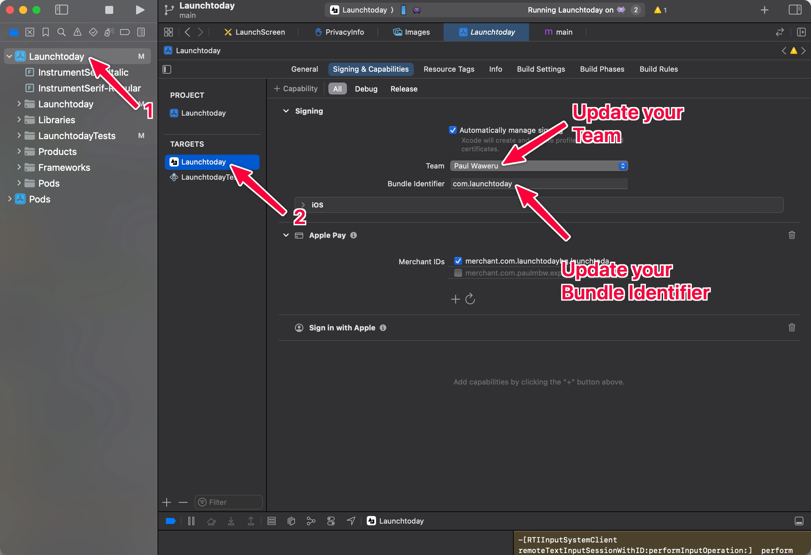
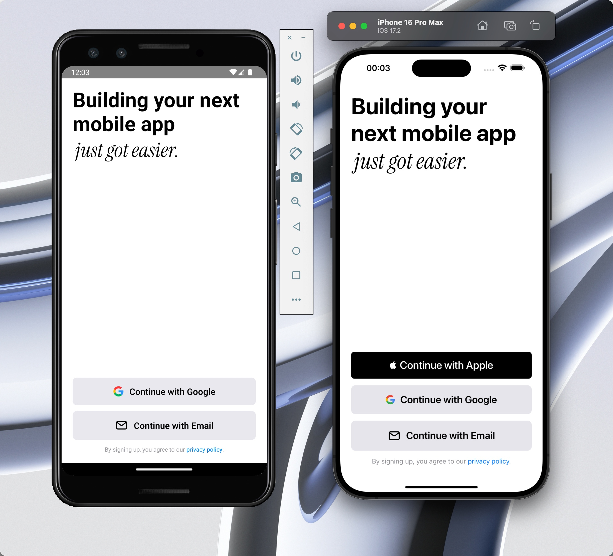

<Info>
  **Prerequisites**: This project requires Node.js version 18 or higher (we
  currently use v18.18.0). Please ensure you have Node.js installed on your
  system before proceeding with the setup process.
</Info>

## Initial Setup

Getting started with Launchtoday involves choosing between two initialization methods, each suited to different development needs and scenarios.

### Option 1: Fork the Repository (Recommended)

We strongly recommend forking the repository as your starting point. This approach provides several significant advantages for your development workflow.
By creating your own fork, you'll maintain a separate version of the codebase that you can freely modify while still keeping the ability to pull updates
from the main repository. This is particularly valuable when you plan to create multiple applications or want to contribute back to the main project.

To get started with this approach:

1. Navigate to [github.com/launchtodayhq/launchtoday-rncli](https://github.com/launchtodayhq/launchtoday-rncli) and click the "Fork" button in the upper
   right corner.
2. Once forked, clone your repository to your local machine using:

```bash
git clone git@github.com:[YOUR_GITHUB_USERNAME]/launchtoday-rncli.git [YOUR_APP_NAME]
```

### Option 2: Direct Clone

If you're planning to create a single application and don't need to maintain a separate fork, you can clone the repository directly. This method is simpler
but provides less flexibility for future updates. To clone directly, use:

```bash
git clone git@github.com:launchtodayhq/launchtoday-rncli.git [YOUR_APP_NAME]
```

## Project Configuration

After successfully cloning the repository using either method above, you'll need to set up your local development environment. Follow these steps in order:

1. Navigate into your newly created project directory
2. Execute the following commands to initialize your development environment:

```bash
nvm use
cp .env.example .env
yarn
```

These commands ensure you're using the correct Node.js version, create your local environment configuration, and install all necessary dependencies.

## Platform-Specific Configuration

### iOS Configuration

Setting up your iOS development environment requires a few additional steps:

1. First, install all required CocoaPods dependencies by running:

```bash
npx pod-install
```

2. Open your iOS project in Xcode using:

```bash
open ios/LaunchToday.xcworkspace
```

3. Once in Xcode, you'll need to configure several important application settings:

   - In the project navigator, select the "Launchtoday" project
   - Select the "Launchtoday" target from the targets list
   - Navigate to the "Signing & Capabilities" tab
   - Update the Bundle Identifier to match your application (e.g., "com.yourcompany.appname")
   - Choose your Development Team from the dropdown menu
   - If you haven't already, you may need to sign in with your Apple ID through Xcode preferences

   

### Android Configuration

To set up your Android development environment, you can either follow our detailed step-by-step instructions below or watch our comprehensive video tutorial
that walks you through the entire process:

<iframe
  width="100%"
  height="400"
  style={{ borderRadius: 10 }}
  src="https://www.youtube.com/embed/iTidkCkdKRk"
  title="Android Setup Video"
  frameBorder="0"
  allow="accelerometer; autoplay; clipboard-write; encrypted-media; gyroscope; picture-in-picture"
  allowFullScreen
></iframe>

The Android setup process requires Android Studio, which you can download from the [official Android Developer website](https://developer.android.com/studio).
Once installed, follow these detailed steps:

1. Open Android Studio and launch the AVD (Android Virtual Device) Manager, which allows you to create and manage virtual devices for testing.

2. Create a new virtual device by following these steps:

   - Click the "Create Virtual Device" button
   - From the hardware profiles, select a device definition (we recommend the Pixel 9 Pro XL for optimal testing)
   - Choose a system image (we recommend API 34 for the best compatibility)
   - Complete the setup process by configuring any additional device settings

3. Configure your application's specific settings:

   - Locate and open the `android/app/build.gradle` file
   - Find the `applicationId` under `defaultConfig` and update it to match your desired package name
   - Make sure to sync your project with Gradle files after making these changes

4. Verify that your development environment is properly configured by running:
   ```bash
   adb devices
   # This command should display your connected device or emulator
   ```

## Running the Application

With your environment configured, you can now launch your application. Choose the appropriate command for your target platform:

```bash
yarn ios:simulator  # Launches the app on your iOS simulator
# or
yarn android        # Launches the app on your Android device or emulator
```

<Info>
  By default, the `ios:simulator` command launches your app on an iPhone 15 Pro
  Max simulator. If you need to target a different iOS simulator, please consult
  our detailed [FAQ guide](/faqs#how-do-i-target-a-specific-ios-simulator).
</Info>

When successfully launched, your application should display the following screen:



## Troubleshooting

If you encounter any difficulties during the setup process or while running the application, we provide several support channels:

1. Our comprehensive [FAQ page](/faqs) addresses common issues and provides detailed solutions
2. For real-time assistance, join our active [Discord community](https://discord.gg/launchtoday)
3. If you believe you've discovered a bug, please create a detailed issue on our [GitHub repository](https://github.com/launchtodayhq/launchtoday-rncli/issues)

Our dedicated development team and community members are committed to helping you overcome any challenges you might face during your development journey.
